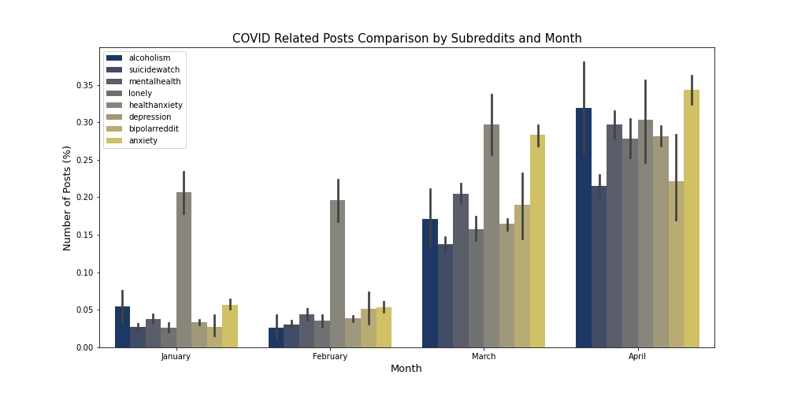
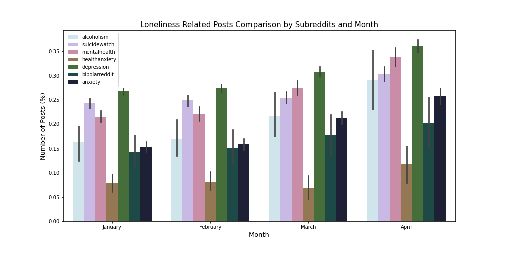
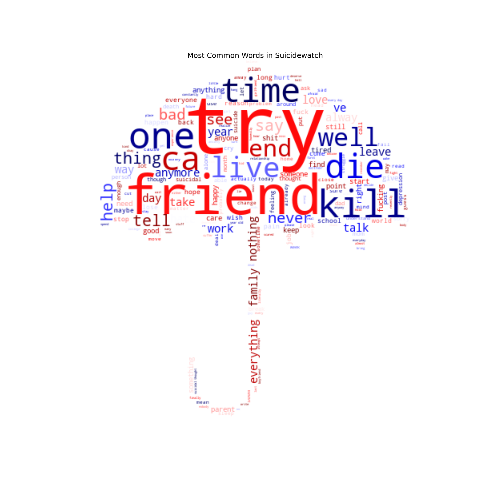

# Suicide Prediction
</img>

## Contents

* [Executive Summary](#Executive-Summary)
* [Problem Statement](#Problem-Statement)
* [Process](#Process)
* [Takeaway](#Takeaway)
* [Data Dictionary](#Data-Dictionary)

## Executive Summary

As COVID is impacting our everyday lives and shaping our present and future the way we did not project, we as people are struggling with keeping up with daily decisions and tasks since we are experiencing something that we did not expect to happen - loneliness, feeling of isolation, stress of not being able to be alone when needed, instability of finances, and etc. Because of this, I would like to find out what has been going on with our mental health pre/post pandemic. On top of this, suicide has risen in recent years and it was the second cause of death for age group between 1 and 44 years old in 2018 statistics published by CDC. For this, I will use natural language processing to understand the impact of COVID19 on mental health, and create a model with neural network, espeically long short term memory (LSTM) to predict suicidality from the reddit data.

## Problem Statement

Suicide has been in top 5 leading causes of death in United States since 1996, and recently it was second cause of death in 20018 in the age group of 1 and 44 years old. (see: <a href='https://www.cdc.gov/injury/wisqars/animated-leading-causes.html' target = '_blank'>CDC - Injury Prevention and Control</a>) In addition to this phenomena, we are experiencing a global pandemic that took over 1 million lives worldwide. Due to this epidemic, stay at home orders have been issued and we had to face rare situations of not being able to find toilet papers, soaps or hand sanitizers. We have been exposed to lots of panic for our physical health - then what about our mental health? We cannot go outside easily without caution; we cannot meet our friends at moment's notice; restaurants and bars are closed. According to an article published on *the conversation*, COVID-19 could lead us to clinical depression outbreak. According to <a href='https://www.hhs.gov/answers/mental-health-and-substance-abuse/does-depression-increase-risk-of-suicide/index.html' target='_blank'>U.S. Department of Health & Human Service</a>, having major depression does increase suicide risk compared to people without depression and the risk of death by suicide may, in part, be related to the severity of the depression. 
Now, the question is - clinical depression could be inavoidable due to the isolation we are going through, then can we detect who's at risk of committing a suicide, especially from text data?

## Process

* Data Collection 

Data has been obtained from a research published earlier this year:  
Low, Daniel M., Rumker, Laurie, Talker, Tanya, Torous, John, Cecchi, Guillermo, & Ghosh, Satrajit S. (2020). Reddit Mental Health Dataset (Version 01) 
The dataset for this project includes posts from 8 subreddits: Alcoholism, Anxiety, Bipolarreddit, Depression, Health Anxiety, Lonely, Mental Health, and Suicide Watch.

* Data Cleaning 

Due to its cleannes of the data, I did not have to go through too much cleaning. However, I deleted all the prepopulated columns that I could not reproduce on my own or that I did not need for this particular project, including various readability indexes, vectorized values, and linguistic inquiry and word count (LIWC).

* Feature Engineering 

To find the relationship between the time and the length of posts, word count and sentence count of a post were added. Also, vectors that were obtained from spaCy was stored in the dataframe as well for easy retrieval.

* Exploratory Data Analysis and Visualization 

One thing that I particularly wanted to see was how COVID reshaped our daily lives and if there were changes in our well being. As expected, people started chatting more about COVID as we started quarantine and states issued stay at home orders in March, and any posts mentioning loneliness increased accordingly.

| Covid Related Posts                                   | Loneliness Related Posts                        |
| ----------------------------------------------------- | ----------------------------------------------- |
|     |     |  

When analyzing text, the easiest way to examine the data is probably looking at the most commonly used words. I created 2 different formats of visualization — one with a word cloud and the other with TF-IDF in a bar graph. As seen below, “try”, “help”, “friend”, and “talk” were some of the common words that were said by people struggling with mental illness in word clouds, and “end”, “die”, “hate”, and “kill” made the top words selection in TF-IDF vectorization (right).

| Top words from Entire dataset                         | Top words from Suicide Watch                    |
| ----------------------------------------------------- | ----------------------------------------------- |
|                     | |  

| Top 20 words from TF-IDF (1 gram)                     | Top 20 from TF-IDF (2 grams)                    |
| ----------------------------------------------------- | ----------------------------------------------- |
|                     | |

* Unsupervised Learning 

Since we are looking to find posts that are suggestive of suicide, a few clustering methods were performed in search for a good representation of data to create a label with multiple word embeddings and vectorizers - such as spaCy, TF-IDF, and word2vec. However, none of them worked well; t-SNE did not show any distinctive clusters, KMeans model grouped one cluster without proportioning well, and lastly Agglomerated clustering was not intuitive enough to detect differences in data due to its homogeneity.

* Semi-supervised Learning 

Semi-supervised learning methods provided by Scikit-learn have been utilized to appropriately create a target label. `LabelSpreading` method produced well balanced labels: detecting 20.5% of entire dataset as indicative of suicide - marking 33% of posts from Suicide Watch, and 21% of posts from Depression as showing suicide tendencies.

* Modeling 

I tried multiple models including Recurrenct Neural Netowork (RNN) with Long Short Term Memory (LSTM) in Bidirectional layer, Colvolutional Network (CNN) with LSTM, and classical classifiers such as Support Vector Machine and XGBoost to compare the results and find the best model. Every single model got very smiliar scores overall, however, clearly XGBoost was performing the best due to its efficiency and its high score without overfitting.

| XGBoost Confusion Matrix                              | XGBoost ROC-AUC Curve                           |
| ----------------------------------------------------- | ----------------------------------------------- |
|           |     | 

## Takeaway

As shown from this project, it is possible to spot suicide from text data with --- accuracy. And hopefully we could implement this in a way to prevent suicides. However, this needs work. The reason that we could find these posts that are suggestive of suicide was due to its anonymity. Without it, people probably would not express how they feel freely. For us to even consider utilizing detection of suicide, we should consider how ethical it would be to use this data without invading people's privacy.

This pandemic has proven tougher times for us physically and mentally. More people are being and feeling isolated, it exhibited that marginalized groups such as ones with mental illness are more impacted. Perhaps this is the time that we pay more attention to those who struggle more. The pandemic alone is not causing issues however, it has made the existing issue more outstanding. From the information that we were able to find, suicide is what people choose when they have no one to talk to, when they could not find belonging in this world.  

The most effective way for us to prevent suicides from happening right now would be to pay attention to those who need us, and to reach out to the loved ones and how they matter to be known.

## Citation

Low, Daniel M., Rumker, Laurie, Talker, Tanya, Torous, John, Cecchi, Guillermo, & Ghosh, Satrajit S. (2020). Natural language processing reveals vulnerable mental health support groups and heightened health anxiety on Reddit during COVID-19: an observational study. Retrieved from https://psyarxiv.com/xvwcy/

Kanter MD, J., Manbeck, K. (2020, April). COVID-19 could lead to an epidemic of clinical depression and the health care system isn't ready for that either. *The Conversation*. Retrieved from https://theconversation.com/covid-19-could-lead-to-an-epidemic-of-clinical-depression-and-the-health-care-system-isnt-ready-for-that-either-134528

## Data Dictionary

|Dataset|Column|Data Format|Data Option|Description|
|---	|---	|---	|---	|---   |
|Final|subreddit|string|    |Which subreddit the post belongs to|
|   	|author|string|    |Person who wrote the post|
|   	|date|datetime|January 1 to April 20, 2020|Date the post was written|
|   	|post|string|    |Post (raw)|
|       |covid_related|integer|0, 1 |Post contains COVID related words|
|       |suicidal|integer|0, 1 |Post contains suicide related words|
|       |alc_abuse|integer|0, 1 |Post contains alcohol related words|
|       |loneliness|integer|0, 1 |Post describes loneliness|
|       |stress|integer|0, 1 |Post expresses stress|
|       |n_words|integer|2 to 5854|Number of words in a post|
|       |n_sentences|integer|1 to 460|Number of sentences in a post|
|       |lemmatized|string|     |Lemmatized post with spaCy|
|       |vectors|string|     |List of vectors obtained with spaCy|  

|Dataset|Column|Data Format|Data Option|Description|
|---	|---	|---	|---	|---   |
|Labeled|subreddit|string|    |Which subreddit the post belongs to|
|   	|author|string|    |Person who wrote the post|
|   	|date|datetime|January 1 to April 20, 2020|Date the post was written|
|   	|post|string|    |Post (raw)|
|       |covid_related|integer|0, 1 |Post contains COVID related words|
|       |suicidal|integer|0, 1 |Post contains suicide related words|
|       |alc_abuse|integer|0, 1 |Post contains alcohol related words|
|       |loneliness|integer|0, 1 |Post describes loneliness|
|       |stress|integer|0, 1 |Post expresses stress|
|       |n_words|integer|2 to 5854|Number of words in a post|
|       |n_sentences|integer|1 to 460|Number of sentences in a post|
|       |lemmatized|string|     |Lemmatized post with spaCy|
|       |label|integer|0, 1   |Post indicates suicide|

## Directory

|__ Code 
|&nbsp;&nbsp;&nbsp;&nbsp;&nbsp;|__ [01-Creating DB.ipynb](./code/01CreatingDB.ipynb) 
|&nbsp;&nbsp;&nbsp;&nbsp;&nbsp;|__ [02-Feature Engineering.ipynb](./code/02FeatureEng.ipynb) 
|&nbsp;&nbsp;&nbsp;&nbsp;&nbsp;|__ [03-Exploratory Data Analysis.ipynb](./code/03EDA.ipynb) 
|&nbsp;&nbsp;&nbsp;&nbsp;&nbsp;|__ [04-Unsupervised Learning.ipynb](./code/04Unsupervised.ipynb) 
|&nbsp;&nbsp;&nbsp;&nbsp;&nbsp;|__ [05-Semi-Supervised Learning - Label Propagation.ipynb](./code/05SemiSuper-LP.ipynb) 
|&nbsp;&nbsp;&nbsp;&nbsp;&nbsp;|__ [05-Semi-Supervised Learning - Label Spreading.ipynb](./code/05SemiSuper-LS.ipynb) 
|&nbsp;&nbsp;&nbsp;&nbsp;&nbsp;|__ [06-Modeling: Bidirectional LSTM.ipynb](./code/06BidirectionalLSTM.ipynb) 
|&nbsp;&nbsp;&nbsp;&nbsp;&nbsp;|__ [06-Modeling: CNN with LSTM.ipynb](./code/06CNN_LSTM.ipynb) 
|__ Data (due to size, data is not included in GitHub repository) 
|&nbsp;&nbsp;&nbsp;&nbsp;&nbsp;|__ [dataset - combined all](./data/cleaned/combined.csv) 
|&nbsp;&nbsp;&nbsp;&nbsp;&nbsp;|__ [dataset - final version (CSV)](./data/cleaned/final.csv) 
|&nbsp;&nbsp;&nbsp;&nbsp;&nbsp;|__ [dataset - final version (JSON)](./data/cleaned/final.json) 
|&nbsp;&nbsp;&nbsp;&nbsp;&nbsp;|__ [dataset - labeled (CSV)](./data/cleaned/labeled.csv) 
|__ Images 
|&nbsp;&nbsp;&nbsp;&nbsp;&nbsp;|__ [Alcohol related posts by month](./images/alcohol_comparison.png) 
|&nbsp;&nbsp;&nbsp;&nbsp;&nbsp;|__ [COVID related posts by month](./images/covid_comparison.png) 
|&nbsp;&nbsp;&nbsp;&nbsp;&nbsp;|__ [Loneliness related posts by month](./images/lonely_comparison.png) 
|&nbsp;&nbsp;&nbsp;&nbsp;&nbsp;|__ [Stress related posts by month](./images/stress_comparison.png) 
|&nbsp;&nbsp;&nbsp;&nbsp;&nbsp;|__ [Suicide related posts by month](./images/suicide_comparison.png) 
|&nbsp;&nbsp;&nbsp;&nbsp;&nbsp;|__ [Number of sentences in a post by month](./imags/n_sents_month.png) 
|&nbsp;&nbsp;&nbsp;&nbsp;&nbsp;|__ [Number of sentences in a post by subreddits](./images/n_sents_reddits.png) 
|&nbsp;&nbsp;&nbsp;&nbsp;&nbsp;|__ [Distribution of number of sentences in a post](./images/sents_dist.png) 
|&nbsp;&nbsp;&nbsp;&nbsp;&nbsp;|__ [Number of words in a post by month](./images/n_words_month.png) 
|&nbsp;&nbsp;&nbsp;&nbsp;&nbsp;|__ [Number of words in a post by subreddits](./images/n_words_reddits.png) 
|&nbsp;&nbsp;&nbsp;&nbsp;&nbsp;|__ [Distribution of number of words in a post](./images/words_dist.png) 
|&nbsp;&nbsp;&nbsp;&nbsp;&nbsp;|__ [Number of posts by month](./images/num_posts_month.png) 
|&nbsp;&nbsp;&nbsp;&nbsp;&nbsp;|__ [Number of posts by subreddits](./images/num_posts_subreddit.png) 
|&nbsp;&nbsp;&nbsp;&nbsp;&nbsp;|__ [Number of posts comparison by subreddits and month](./images/pct_category_month.png) 
|&nbsp;&nbsp;&nbsp;&nbsp;&nbsp;|__ [WordCloud - Entire dataset](./images/wc_whole.png) 
|&nbsp;&nbsp;&nbsp;&nbsp;&nbsp;|__ [WordCloud - Alcoholism](./images/wc_alcoholism.png) 
|&nbsp;&nbsp;&nbsp;&nbsp;&nbsp;|__ [WordCloud - Anxiety](./images/wc_anxiety.png) 
|&nbsp;&nbsp;&nbsp;&nbsp;&nbsp;|__ [WordCloud - Bipolar](./images/wc_bipolarreddit.png) 
|&nbsp;&nbsp;&nbsp;&nbsp;&nbsp;|__ [WordCloud - Depression](./images/wc_depression.png) 
|&nbsp;&nbsp;&nbsp;&nbsp;&nbsp;|__ [WordCloud - Health Anxiety](./images/wc_healthanxiety.png) 
|&nbsp;&nbsp;&nbsp;&nbsp;&nbsp;|__ [WordCloud - Lonely](./images/wc_lonely.png) 
|&nbsp;&nbsp;&nbsp;&nbsp;&nbsp;|__ [WordCloud - Mental Health](./images/wc_mentalhealth.png) 
|&nbsp;&nbsp;&nbsp;&nbsp;&nbsp;|__ [WordCloud - Suicide Watch](./images/wc_suicidewatch.png) 
|&nbsp;&nbsp;&nbsp;&nbsp;&nbsp;|__ [WordCloud - January](./images/wc_january.png) 
|&nbsp;&nbsp;&nbsp;&nbsp;&nbsp;|__ [WordCloud - February](./images/wc_february.png) 
|&nbsp;&nbsp;&nbsp;&nbsp;&nbsp;|__ [WordCloud - March](./images/wc_march.png) 
|&nbsp;&nbsp;&nbsp;&nbsp;&nbsp;|__ [WordCloud - April](./images/wc_april.png) 
|&nbsp;&nbsp;&nbsp;&nbsp;&nbsp;|__ [Top 20 Words - TF-IDF, 1 gram](./images/top20_tf.png) 
|&nbsp;&nbsp;&nbsp;&nbsp;&nbsp;|__ [Top 20 words - TF-IDF, 2 grams](./images/top20_2gram.png) 
|&nbsp;&nbsp;&nbsp;&nbsp;&nbsp;|__ [Top 20 words - TF-IDF, 3 grams](./images/top20_3gram.png) 
|&nbsp;&nbsp;&nbsp;&nbsp;&nbsp;|__ [XGBoost - Confusion Matrix](./images/XGB_Confusion.png) 
|&nbsp;&nbsp;&nbsp;&nbsp;&nbsp;|__ [XGBoost - ROC-AUC Curve](./images/XGB_AUC.png) 
|__ [Presentation](./Suicide_Prediction.pdf) 
|__ [README.md](./README.md)
